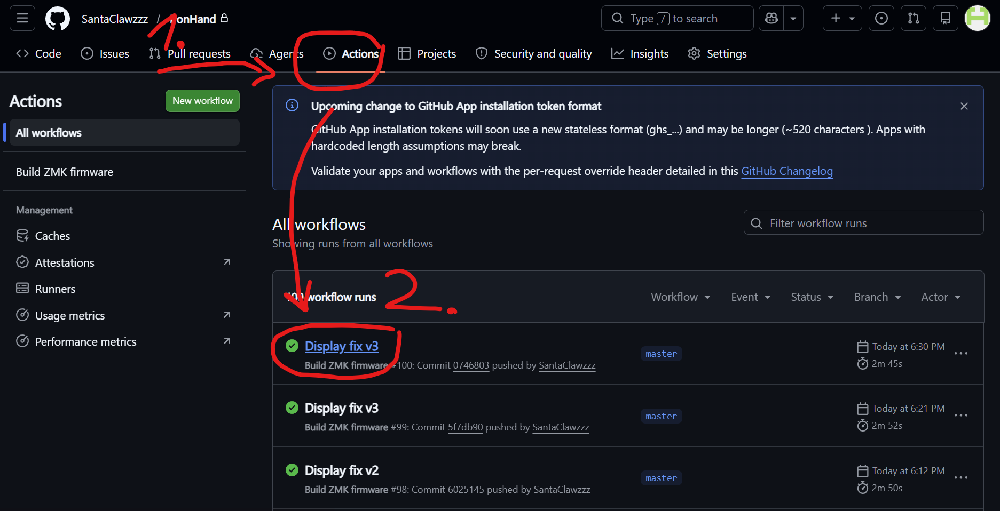
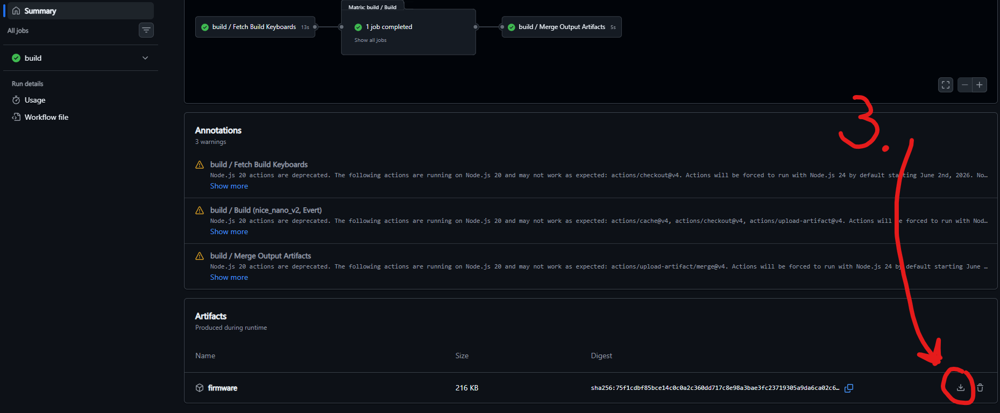

# Ironhand keyboard

A full-sized keyboard in ZMK. Features a colored TFT screen, encoder, bluetooth connection and a battery. 
Numpad is on the left side and switches are easily replaceable with hotswap sockets. Tarkov themed.

* Keyboard specs:
  * 1 nice!nano v2 or nrf52840 pro Micro devkit
  * 1 MCP23S17-E_SO
  * 102 switches (MX)
  * 102 DO-35 diodes (1N4148)
  * 60 100nF 0603 capacitors (Any 100nF)
  * 103 LEDs (WS2812-2020) [One LED under the MCU]
  * One 2000mAh 3.7V LiPo Battery [Bridge the Charging pads under nice!nano]
  * 1 battery connector (JST PH 2.0)
  * 1 0.96" TFT SPI screen
  * 1 encoder
  * 1 button (TL3305A, optional)

## Electronics

The PCB order can be expensive, mostly shipping due to the size. I recommend ordering at least 10 (5 is minimum). 
The soldering is mostly fine, hotswap sockets and capacitors are easy but the LEDs are a pain. 
My recommendation:
* Solder one corner of the 4 pads on the entire row
* Take a LED and match the polarity
* Solder only by the corner for the entire row
* Then go backwards and solder the same side other corner, turn it and do the other side
  * Easier to do one side at a time
  * Holding the solder iron in the right hand do the right side of the LED
  * Then turn it 180 degrees and solder the other side
  * But to each their own
* the MCP soldering is basically the same, do one corner, align it, then solder the rest of the pins
* Keep in mind that the devkit has a pad under it that needs to be bridged to charge faster if you have a battery bigger than 500mAh!
* Also there is a LED under the devkit on the PCB, solder them first then the devkit on it.
* Otherwise without a desolder gun, you're gonna have a bad time.

## Mechanics

If you wish to change the project files, go ahead. It was designed in Fusion.
Printed with PETG and mostly default settings.
Two halves were attached with a metal plate and staples melted into the PETG halves.

## Firmware

* Connect USB-C
* Open ***Actions*** tab in this github repository
* Download the firmware  

* Double press the reset button on the keyboard and drop the file into the file system
  * If you are in bootloader the red LED will constantly blink (nrf pro Micro devkit)

## Notes to consider when building custom keyboard

Read the documentation thoroughly, the directory of the files is VERY IMPORTANT. 
It's much more restrict than QMK so it will take some time. 
Just try to get it to compile wihtout much code and then start adding features.